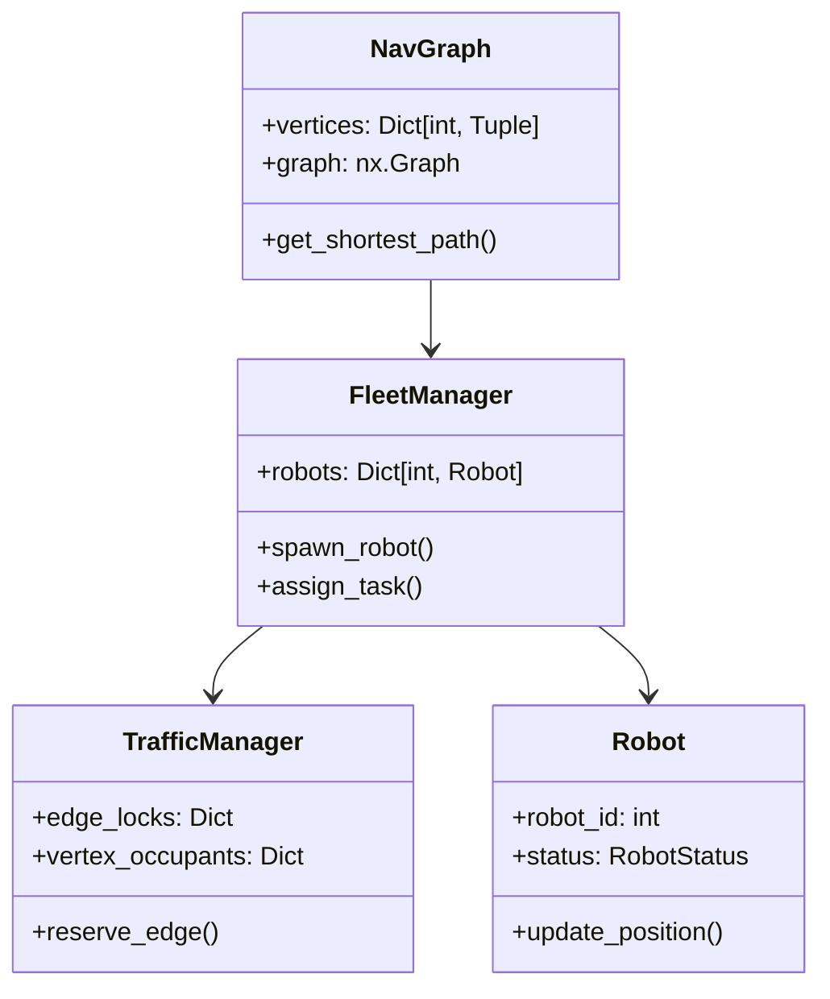
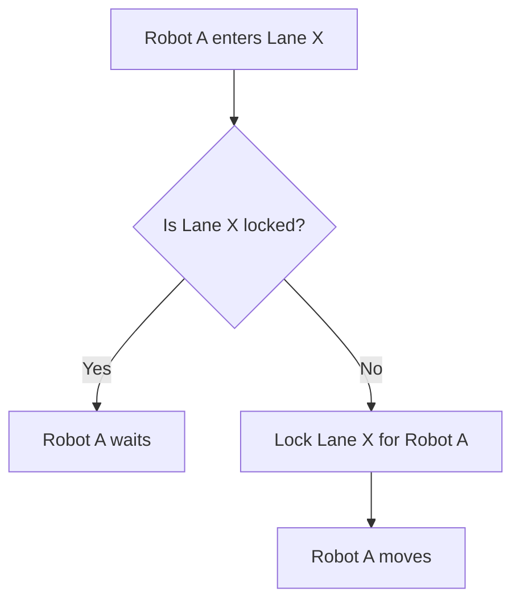

# GoatPSGHackathon_22PD11

 # **Fleet Management System with Traffic Negotiation**  
*Hackathon Project Documentation*
nav_graph1


nav_graph2


nav_graph3


---

## **1. System Overview**  
A Python-based GUI system for managing multiple robots navigating through a shared environment using a navigation graph (`nav_graph`). Key features:  
- **Collision-free navigation** in lanes (bidirectional/uni-directional).  
- **Dynamic task assignment** with real-time pathfinding.  
- **Traffic negotiation** (waiting, rerouting, deadlock prevention).  
- **Interactive visualization** of robots, vertices, and lanes.  

---

## **2. Core Components**  

### **2.1 Navigation Graph (`nav_graph.py`)**  
- **Data Structure**: NetworkX graph with vertices (coordinates + `is_charger` flag) and edges (lanes).  
- **Key Logic:**  
```python
  def get_shortest_path(start, end, occupied_vertices=None):
      """A* pathfinding avoiding occupied vertices."""
```
- Uses Euclidean distance heuristic for efficient path calculation.  

### **2.2 Robot (`robot.py`)**  
- **States**: `IDLE`, `MOVING`, `WAITING`, `BLOCKED`, `TASK_COMPLETE`.  
- **Key Logic:**  
  - **Movement:** Cubic easing for smooth interpolation between vertices.  
  - **Collision Handling:**  
```python
    def _is_on_shared_path(self):  # Checks edge conflicts with other robots.
```
  - **Backtracking:** Triggered after consecutive blocks to avoid deadlocks.  

### **2.3 Traffic Manager (`traffic_manager.py`)**  
- **Collision Avoidance:**  
  - **Edge Locks:** Reserves lanes for robots (`edge_locks` dictionary).  
  - **Vertex Occupancy:** Tracks robot positions (`vertex_occupants`).  
- **Deadlock Prevention:**  
```python
  def should_backtrack(robot_id):  # Forces stuck robots to reverse.
```

### **2.4 Fleet Manager (`fleet_manager.py`)**  
- **Orchestration:**  
  - Spawns robots at vertices.  
  - Assigns tasks and triggers pathfinding.  
  - Updates robot states in a loop (`update_robots()`).  
- **Task Assignment:**  
```python
  def assign_task(robot_id, target_vertex):  # Validates path + reserves edges.
```

---

## **3. Key Algorithms**  

### **3.1 Pathfinding & Traffic Negotiation**  
1. **Shortest Path Calculation:**  
   - A* algorithm with dynamic obstacle avoidance (`occupied_vertices`).  
2. **Edge Reservation:**  
   - Robots request lanes via `TrafficManager.reserve_edge()`.  
   - Blocked robots queue at vertices (`waiting_queues`).  

### **3.2 Collision Detection**  
- **Lane Conflicts:**  
```python
  def check_collision(robot_id, x, y):  # Uses safety radii + shared path detection.
```
- **Vertex Conflicts:** Multiple robots allowed unless `is_charger=True`.  

### **3.3 Deadlock Resolution**  
1. **Backtracking:** Robots reverse to last unblocked vertex.  
2. **Alternate Paths:** Recalculates paths avoiding occupied vertices.  

---

## **4. Class Diagrams (Simplified)**  


---

## **5. Flowcharts**  

### **5.1 Task Assignment Flow**  
1. User clicks robot → destination.  
2. `FleetManager` calls `nav_graph.get_shortest_path()`.  
3. `TrafficManager` checks lane availability.  
4. If blocked: Robot queues; else: reserves edges and moves.  

### **5.2 Collision Handling Flow**  


---

## **6. Test Cases & Validation**  
| **Scenario**               | **Expected Behavior**                          |  
|----------------------------|-----------------------------------------------|  
| Two robots on same lane     | One waits until lane clears.                  |  
| Charger vertex occupied    | Robot queues until charger free.              |  
| No valid path              | GUI shows "No path available" notification.   |  

---

## **7. Setup Instructions**  
1. Install dependencies:  
```bash
pip install -r requirements.txt  # Includes PyQt5, NetworkX.
```
2. Run:  
```bash
python src/main.py
```

---

## **8. Future Enhancements**  
- **Priority-Based Routing:** VIP robots get lane priority.  
- **Battery Management:** Low-battery robots auto-route to chargers.  
- **Dynamic Obstacles:** Handle real-time lane blockages.  


